# Project: Deploy a Microservice Application on AWS ECS with GitHub, CodePipeline, DocumentDB, and Valkey

## I. Introduction

### About me

👋 Hi, I'm **Jayce** — a Cloud / DevOps engineer focused on building reliable platforms on Cloud Platforms like AWS, Azure, GCP, ...

This EasyShop lab is my hands-on project to practice end-to-end delivery: multi-environment, infrastructure as code, CI/CD, and observability in a production-like setup.

🛠️ **Focus areas**

| Area | Skills |
| ---- | ------ |
| ☁️ Cloud | AWS (ECS Fargate, VPC, ALB, CloudFront, DocumentDB, ElastiCache, ECR, IAM, KMS) |
| 🏗️ IaC | Terraform, modular AWS infrastructure |
| 🔁 CI/CD | GitHub, CodePipeline, CodeBuild, CodeStar Connections |
| 📦 Containers | Docker, Docker Compose, ECS Fargate, ECR |
| 📊 Observability | CloudWatch Logs, ECS Container Insights |

### About this project

🛒 This project deploys an **EasyShop microservice** application on **AWS** with two environments:

- 🧪 **Dev** — APIs on Docker Compose (EC2); web-ui on CloudFront + S3; DocumentDB and Valkey in AWS
- 🚀 **Prod** — ECS Fargate APIs, DocumentDB, ElastiCache Valkey, CloudFront, S3 for the UI

Delivery path:

- 🐙 **GitHub** — source for infra and each microservice
- 🔁 **CodePipeline + CodeBuild** — build images, push to ECR, deploy the static UI to S3
- 📜 **CloudWatch** — container logs and ECS Container Insights

The goal is a complete path from Terraform infrastructure → CI pipeline → ECS deploy → logging.

**Original codebase (frontend):** [iemafzalhassan/EasyShop](https://github.com/iemafzalhassan/EasyShop)

> The storefront started from that repository. Backend APIs were split into Node.js microservices. Infrastructure, CI/CD, and AWS hosting were built for this lab.

## Table of Contents

- [I. Introduction](#i-introduction)
- [II. Overview](#ii-overview)
  - [1. Architecture](#1-architecture)
  - [2. Tech stack](#2-tech-stack)
  - [3. Services](#3-services)
  - [4. Repository](#4-repository)
- [III. Prerequisites](#iii-prerequisites)
  - [AWS account](#aws-account)
  - [Domain](#domain)
  - [GitHub account](#github-account)
  - [Local setup](#local-setup)
- [IV. Deploy Infrastructure — Development](#iv-deploy-infrastructure--development)
  - [1. Config Terraform variables](#1-config-terraform-variables)
  - [2. Setup S3 backend remote state](#2-setup-s3-backend-remote-state)
  - [3. Deploy Route53 Hosted Zone in production environment](#3-deploy-route53-hosted-zone-in-production-environment)
  - [4. Validate domain certificates](#4-validate-domain-certificates)
  - [5. Deploy the development infrastructure](#5-deploy-the-development-infrastructure)
  - [6. Setup Secret Manager for development environment](#6-setup-secret-manager-for-development-environment)
  - [7. Connect to EC2, build and run Docker Compose](#7-connect-to-ec2-build-and-run-docker-compose)
  - [8. Setup CI/CD for development](#8-setup-cicd-for-development)
  - [9. Verify application development environment](#9-verify-application-development-environment)
- [V. Deploy Infrastructure — Production](#v-deploy-infrastructure--production)
  - [1. Deploy the rest of the services](#1-deploy-the-rest-of-the-services)
  - [2. Update application secrets](#2-update-application-secrets)
  - [3. Setup CI/CD for production](#3-setup-cicd-for-production)
  - [4. Setup logging and monitoring (CloudWatch)](#4-setup-logging-and-monitoring-cloudwatch)
- [VI. Clean up the lab](#vi-clean-up-the-lab)
  - [1. Destroy the lab](#1-destroy-the-lab)
  - [2. Destroy the S3 state bucket (optional)](#2-destroy-the-s3-state-bucket-optional)

## II. Overview

- This lab deploys EasyShop as microservices on AWS with a **dev** (Docker Compose all-in-one) and **prod** (ECS Fargate) path.
- Terraform provisions the AWS stack: VPC, ECS, ECR, ALB, CloudFront, DocumentDB, ElastiCache (Valkey), and supporting IAM, KMS, and Secrets Manager resources.
- Three Node.js / Express services (Auth, Product, Cart) run on ECS Fargate; a Next.js SPA is served from S3 behind CloudFront.
- GitHub stores source. CodePipeline + CodeBuild build API images to ECR and sync the UI to S3 + CloudFront.
- Observability uses CloudWatch Logs per ECS service and Container Insights on the cluster.
- DocumentDB and Valkey sit in private subnets. A bastion host is used for admin access.
- The result is an end-to-end path from infrastructure as code through CI/CD and production-style logging.

### 1. Architecture

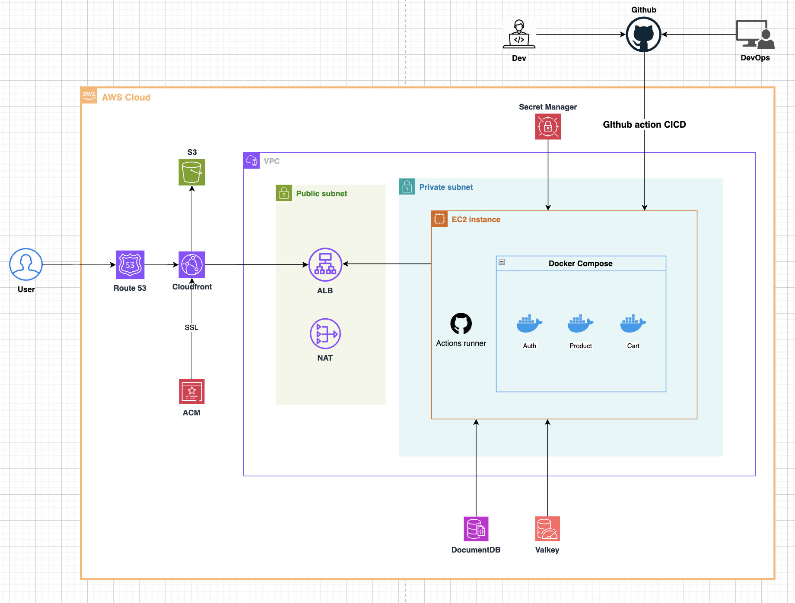
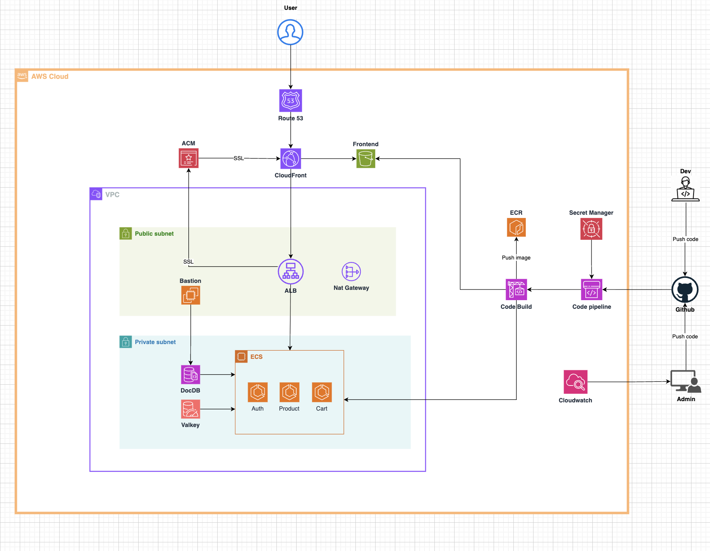

```
Browser → CloudFront (easyshops.jayce-lab.works)
            ├─ default     → S3 (web-ui)
            └─ /api/*      → ALB
                              ├─ /auth, /auth/*                         → auth :4000
                              ├─ /products, /singleProduct              → product :5000
                              └─ /cart, /orders                         → cart :6000
DocumentDB :27017 and Valkey :6379 in private subnets 
```

### 2. Tech stack

| Layer | Tools |
| ----- | ----- |
| Cloud | AWS (VPC, EC2, ECS Fargate, ECR, ALB, CloudFront, S3, Route53, ACM, DocumentDB, ElastiCache, KMS, Secrets Manager, IAM, CloudWatch, CodePipeline, CodeBuild) |
| IaC | Terraform |
| CI/CD | GitHub, CodeStar Connections, CodePipeline, CodeBuild |
| Backend | Node.js, TypeScript, Express, Mongoose, JWT, MongoDB / DocumentDB, Valkey/Redis |
| Frontend | Next.js 14, React 18, Redux, Tailwind; hosted on S3 + CloudFront |
| Dev runtime | Docker Compose (APIs on EC2); web-ui on S3 + CloudFront |
| Logging | CloudWatch Logs, ECS Container Insights |

### 3. Services

Internet-facing hostname format: `<env>-<application_name>.<your-domain>` (dev) or `<application_name>.<your-domain>` (prod).

| Env | Service | Port | Public hostname (Example) | Description |
| --- | ------- | ---- | --------------- | ----------- |
| Prod | Auth-service | 4000 | `https://easyshops.jayce-lab.works/auth` | Login, register, JWT session |
| Prod | Product-service | 5000 | `https://easyshops.jayce-lab.works/products` | Catalog API; caches with Valkey |
| Prod | Cart-service | 6000 | `https://easyshops.jayce-lab.works/cart` | Cart and orders API; calls Product service |
| Prod | Web-ui-service | 443 | `https://easyshops.jayce-lab.works` | Next.js storefront; CloudFront + S3 (HTTPS) |
| Dev | Web-ui-service | 443 | `https://dev-easyshops.jayce-lab.works` | Next.js storefront; CloudFront + S3 (HTTPS) |

**Dev (Docker Compose on EC2)** — APIs only (`auth` :4000, `product` :5000, `cart` :6000). Public UI is CloudFront + S3. DocumentDB and Valkey are AWS-managed.

### 4. Repository

This workspace stores all source. Each service folder maps to a **separate GitHub repo**. The `dev/` and `prod/` folders both map to the **same repos**, just pushed to different branches. CI/CD uses CodePipeline per service.

```
Easy shop/
├── env/
│   ├── dev/                             # → Push to branch: dev
│   │   ├── Services/
│   │   │   ├── auth/                    # → GitHub: easyshop-auth
│   │   │   ├── product/                 # → GitHub: easyshop-product
│   │   │   ├── cart/                    # → GitHub: easyshop-cart
│   │   │   └── web-ui/                  # → GitHub: easyshop-web-ui 
│   │   └── easyshop-infra/              # → GitHub: easyshop-infra
|   |
│   └── prod/                            # → Push to branch: main
│       ├── Services/
│       │   ├── auth/                    # → GitHub: easyshop-auth
│       │   ├── product/                 # → GitHub: easyshop-product
│       │   ├── cart/                    # → GitHub: easyshop-cart
│       │   └── web-ui/                  # → GitHub: easyshop-web-ui
│       └── easyshop-infra/              # → GitHub: easyshop-infra
├── docs/
├── images/
└── README.md
```

- Clone this workspace to get the source tree.
- `env/dev/*` → push to branch **dev** of each repo.
- `env/prod/*` → push to branch **main** of each repo.

## III. Prerequisites

### AWS account

- Prepare an 2 AWS accounts (one for development and one for production) and sign in to the AWS Management Console.


- Create 2 AWS SSO profile for development and production in `~/.aws/config`. Example:

```
[profile sso]
sso_session = sso
sso_account_id = <your-aws-account-id>
sso_role_name = <your-aws-role-name>
```

```bash
aws sso login --profile <your-aws-profile>
export AWS_PROFILE=<your-aws-profile>
aws sts get-caller-identity
```

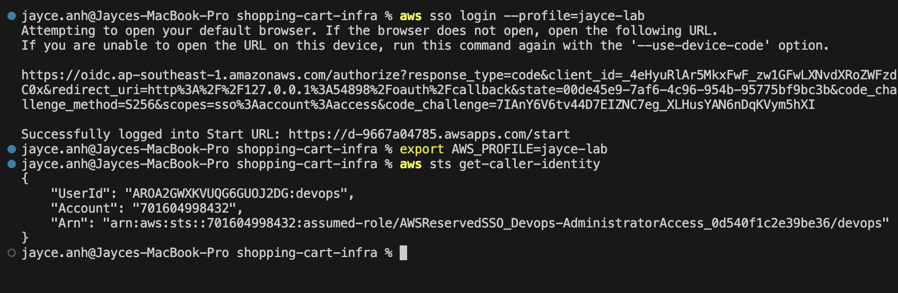

- Optional: If you want SSH to the bastion, application server, etc. instead of Session Manager, create an EC2 key pair in AWS console, then download the private key and set your key in the ec2 module.

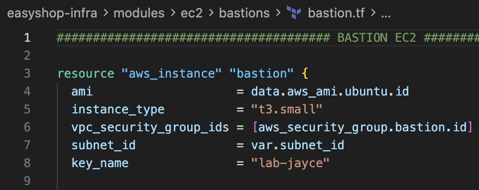
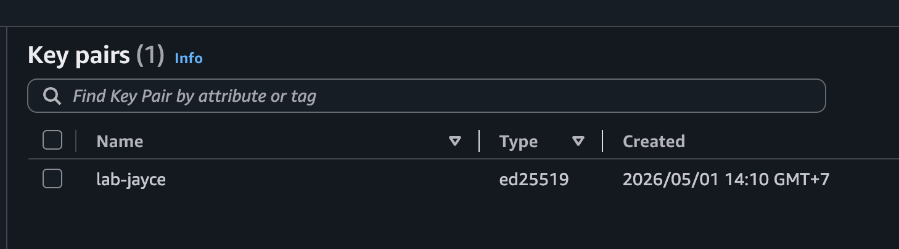

### Domain

- Buy a domain from a registrar such as Cloudflare, GoDaddy, or Namecheap. Mine is: `jayce-lab.works`.

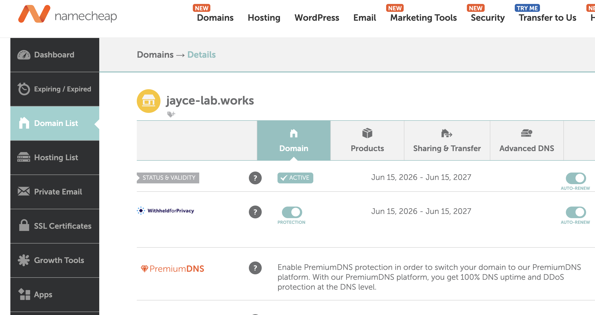

### GitHub account

- This workspace stores the source code. Push each folder to its own GitHub repo.
- Create your Github Organization, and from there create these repositories: `easyshop-infra`, `easyshop-auth`, `easyshop-product`, `easyshop-cart`, `easyshop-web-ui`.
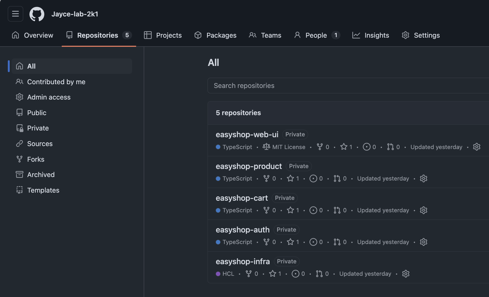
- Create two branches in each repository for each environment: **dev** and **main**.
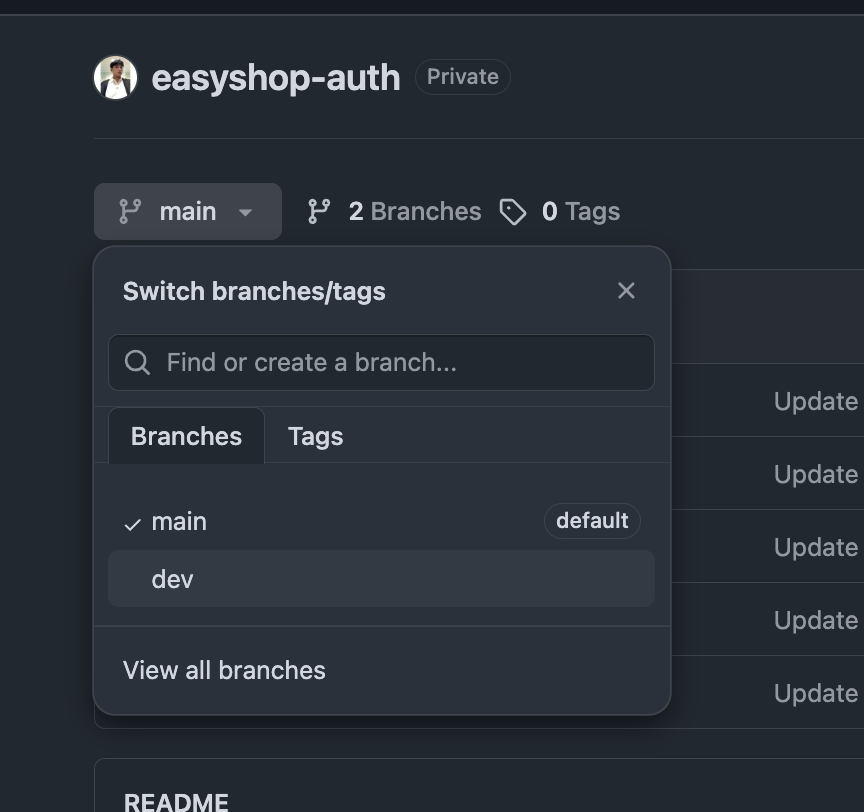

### Local setup

- Clone this workspace. Push each `env/dev/*` and `env/prod/*` folder as branch **dev** and **main** 

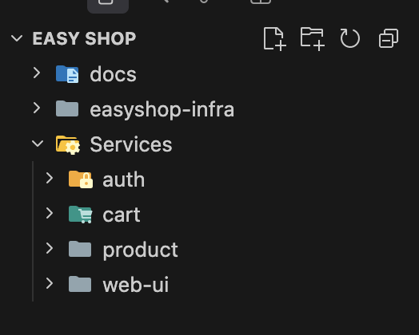

- Install the required tools: AWS CLI, Git, Terraform, Docker, Docker Compose, and Session Manager plugin (optional).

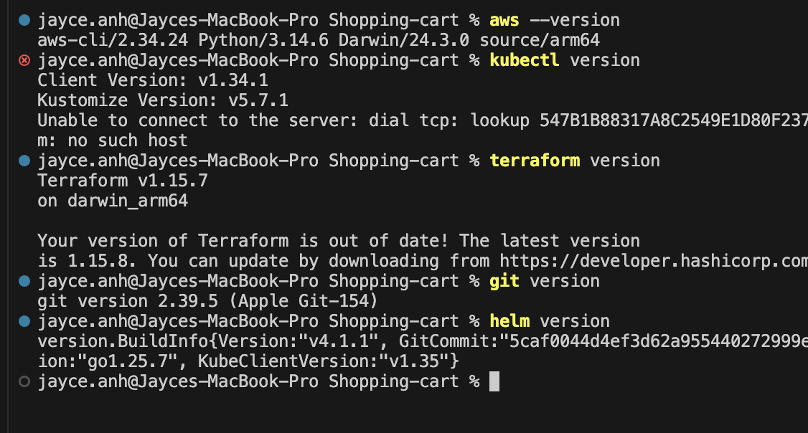

- Login to AWS via AWS CLI.

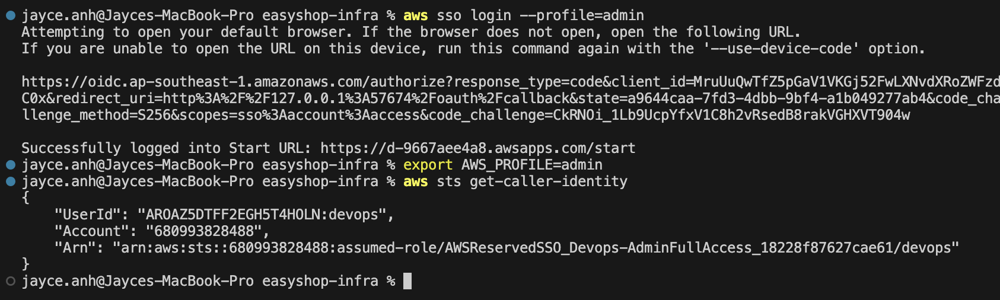

- Create Key-pair to connect to the EC2 Bastion and Application Server, if you don't want to use Session Manager.

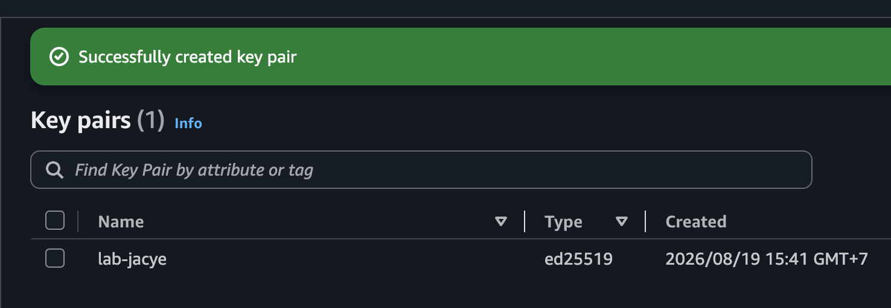
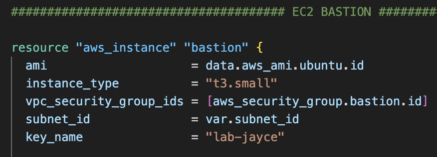

## IV. Deploy Infrastructure — Development

### 1. Config Terraform variables  

- Configure the remote state Terraform variables in `easyshop-infra/remote-tfstate/terraform.tfvars` and root module Terraform variables in `easyshop-infra/terraform.tfvars`. Replace the values with your own.
- Do the same for the production environment.

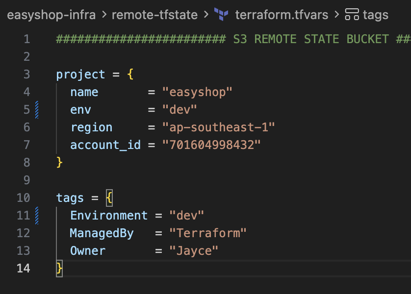

### 2. Setup S3 backend remote state

Set up an S3 backend for Terraform state to avoid deployment conflicts and improve state management. Run this from `easyshop-infra/remote-tfstate`.

```bash
cd easyshop-infra/remote-tfstate
terraform init
terraform apply
```

This creates bucket `dev-easyshop-tf-state` (from `remote-tfstate/terraform.tfvars`). Use this bucket for **dev** Terraform state (different state keys or workspaces).

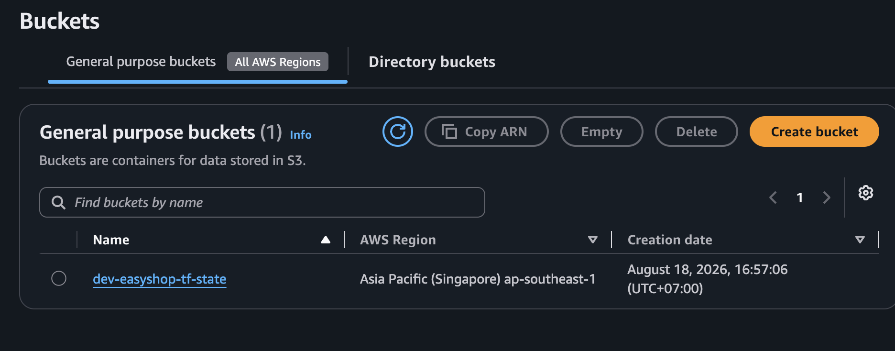
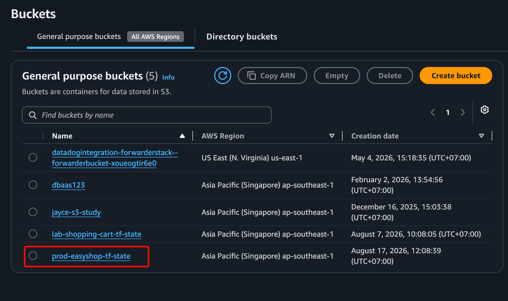

- Go to root module, run `terraform init` to download the required providers.

### 3. Deploy Route53 Hosted Zone in production environment

- We will deploy the Route53 Hosted Zone in production environment first to validate the domain for both environments.

```bash
cd easyshop-infra
git switch main
terraform apply --target=module.hosted_zone
```

- Go to your domain registrar and add a domain name server (DNS) for the Route53 Hosted Zone. Wait for the Route53 Hosted Zone to be created. About 10-30 minutes.

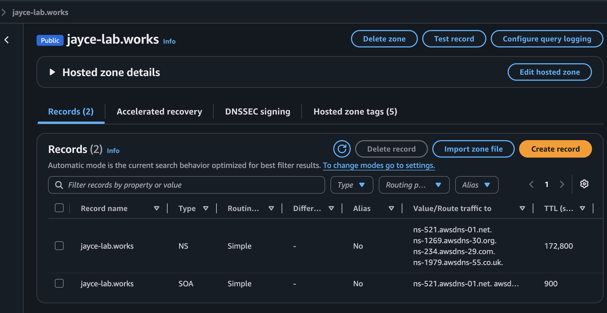
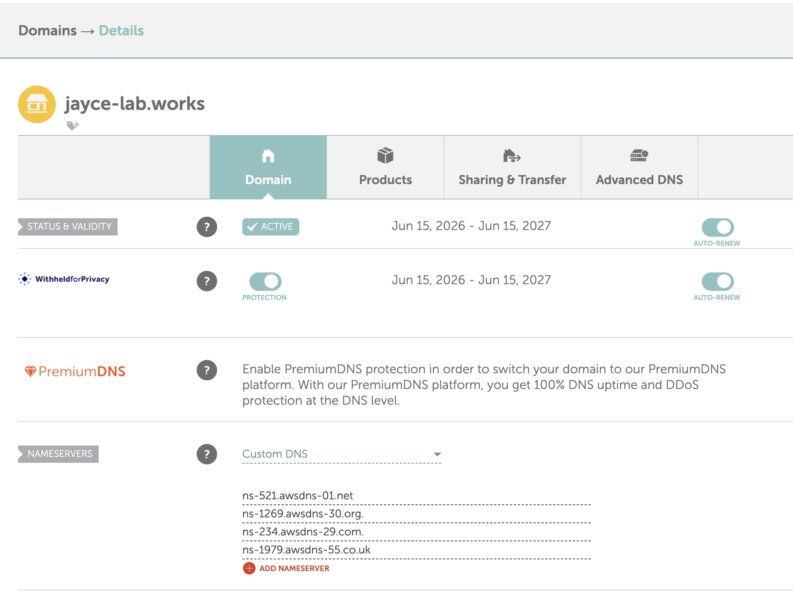


### 4. Validate domain certificates
- Deploy the ACM module in development environment to validate the domain.

```bash
cd easyshop-infra
git switch dev
terraform apply --target=module.acm
```
- Go to ACM in AWS Console (Production account), then copy CNAME name and value.
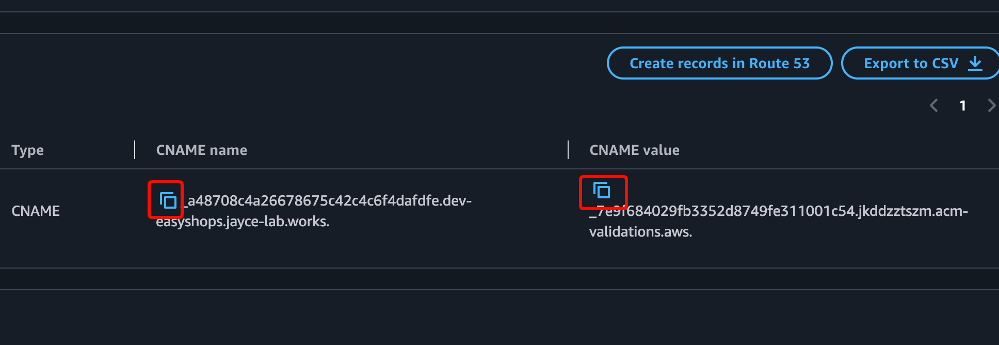
- Go to Hosted Zone in AWS Console (Production account) and create a DNS record for the dev domain with the CNAME name and value. Wait for the ACM certificates to be created. About 10-30 minutes.

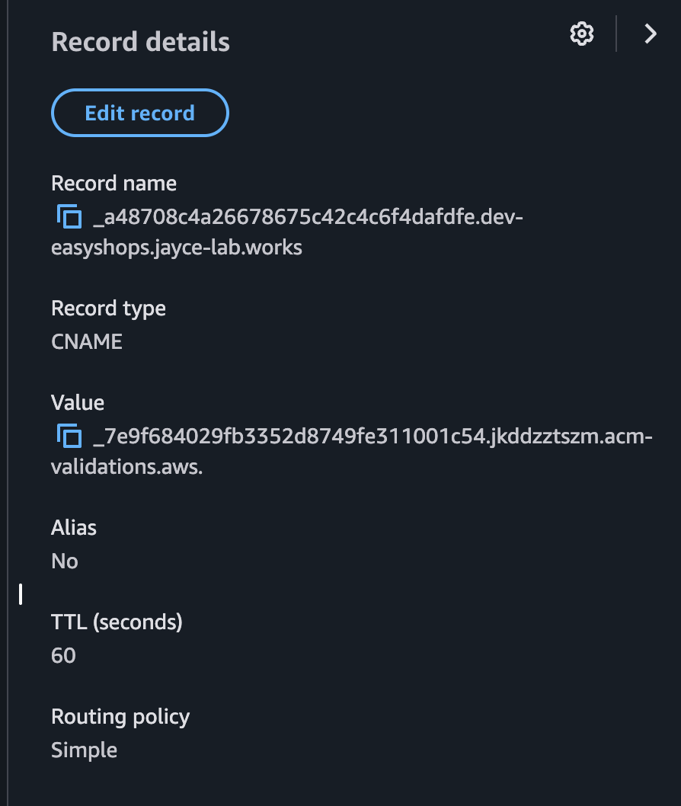
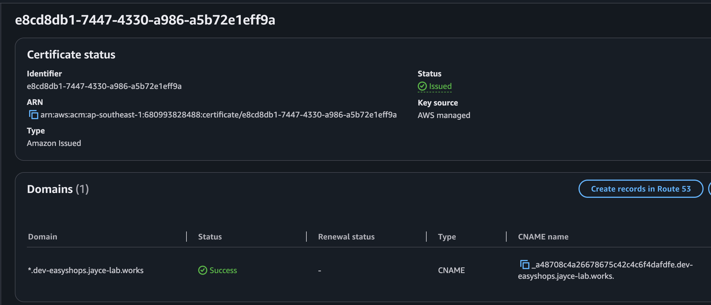

### 5. Deploy the development infrastructure

- Deploy the development infrastructure by running `terraform apply` in `easyshop-infra`. Wait for the infrastructure to be deployed.

```bash
cd easyshop-infra
git switch dev
terraform apply
```

| Service | Component | Description |
| ------- | --------- | ----------- |
| EC2 | EC2 instance (`t3a.medium`) | Runs Docker Compose for auth, product, and cart; EventBridge Scheduler starts at 09:00 and stops at 18:00 SGT |
| ALB | External Application Load Balancer | HTTPS load balancer with IP target groups for auth (4000), product (5000), and cart (6000) |
| CloudFront | CloudFront + S3 origin | Hosts web-ui on S3; alias `dev-easyshops.jayce-lab.works`; routes `/api/*` to ALB |
| ECR | Private repositories | Image registries for `auth`, `product`, and `cart` |
| DocumentDB | DocDB 5.0 (`db.t3.medium`, port 27017) | MongoDB-compatible cluster in private subnets; EventBridge Scheduler starts at 09:00 and stops at 18:00 SGT |
| Valkey | ElastiCache Valkey 7.2 (`cache.t3.micro`, 2 nodes, port 6379) | In-memory cache for product and cart; automatic failover |
| Secrets Manager | App secrets | Stores DocumentDB and Valkey connection values for auth, product, cart, and web-ui |

### 6. Setup Secret Manager for development environment

- Go to AWS Secret Manager console, verify the secret is created by Terraform.
- It should already contain DocumentDB and Valkey connection values for auth, product, cart, and web-ui.

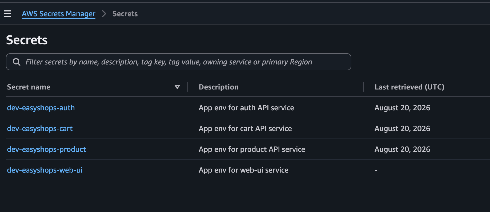
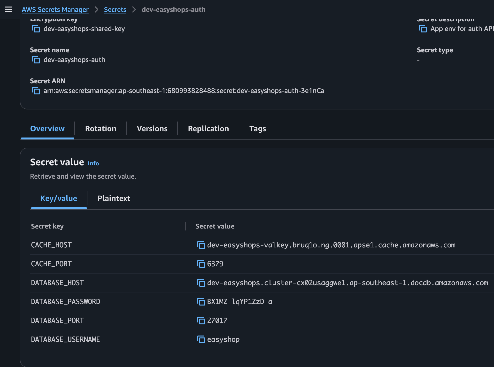

- Add the remaining secrets values in `env.example` file in each auth, product, cart, and web-ui service folder. 
- The envs must be in plain text format for Docker Compose to read.
  - Option 1: You can use python3 to convert the secret values from json format to plain text format in cicd pipeline file `.github\workflows\dev-auth.yml`.
```bash
aws secretsmanager get-secret-value --secret-id ${SECRET_MANAGER} --region ${REGION} --query SecretString --output text | jq -r 'to_entries[] | "\(.key)=\(.value)"' > .env
```
- Option 2: Edit convert all secrets values to plain text format manually in AWS console. 
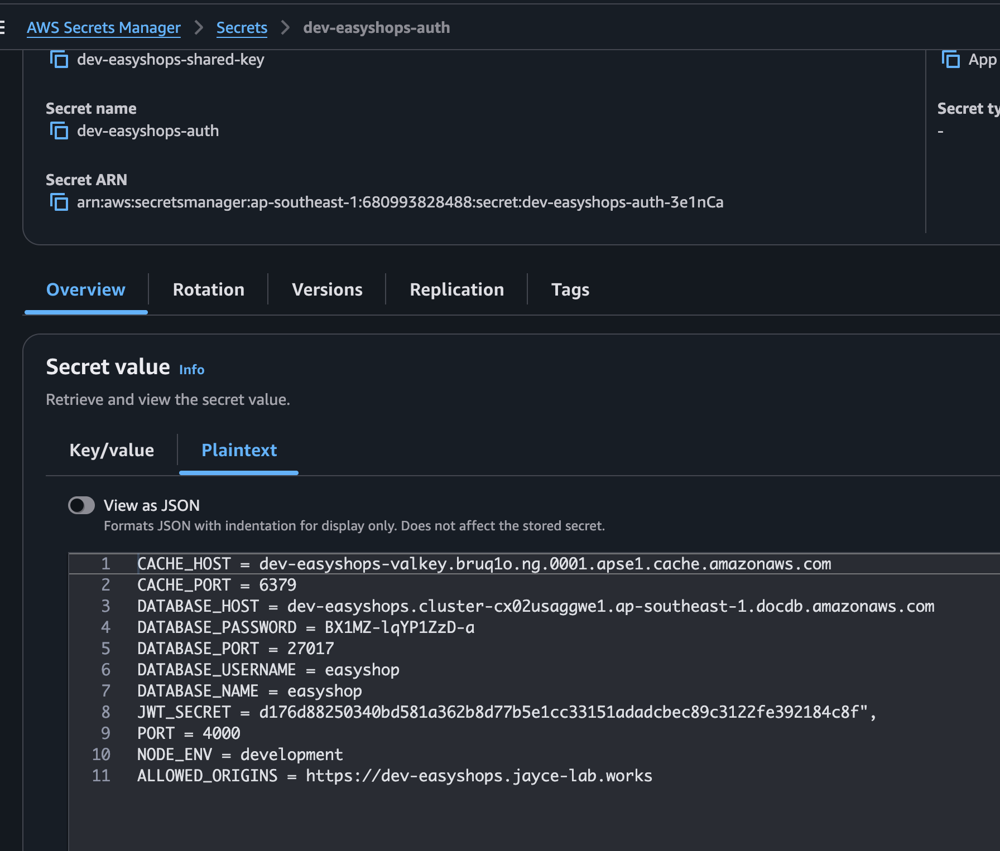

### 7. Connect to EC2, build and run Docker Compose
```bash
aws ssm start-session --target <ec2-instance-id> # if you use Session Manager
# or
ssh -i ~/.ssh/<your-key-pair>.pem ubuntu@<ec2-eip> # if you use Key-pair
```
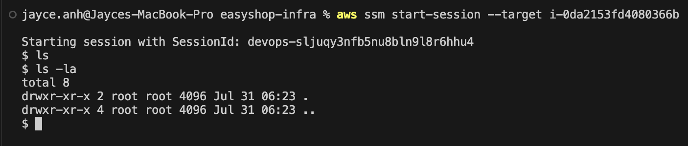

- Switch user to ubuntu if you use Session Manager.
```bash
sudo su - ubuntu
```
- Clone service repositories and move Docker Compose file from "web-ui" folder to the root folder:

```bash
mkdir easyshop && cd easyshop
git clone https://github.com/Jayce-Anh/easyshop-auth.git
git clone https://github.com/Jayce-Anh/easyshop-product.git
git clone https://github.com/Jayce-Anh/easyshop-cart.git
git clone https://github.com/Jayce-Anh/easyshop-web-ui.git
mv easyshop-web-ui/docker-compose.yml .
```
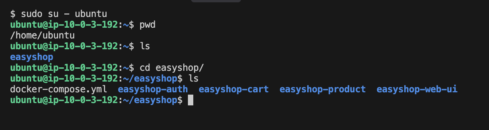

### 8. Setup CI/CD for development

- Setup Self host group runner **dev-easyshop** for CI/CD in Github Organization console: Settings -> Actions -> Runner Groups -> New runner group -> Create group -> New runner.
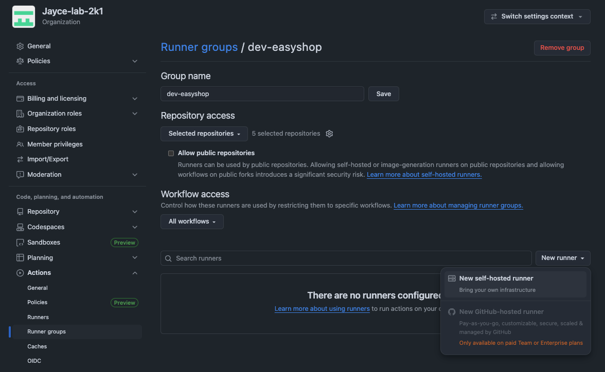
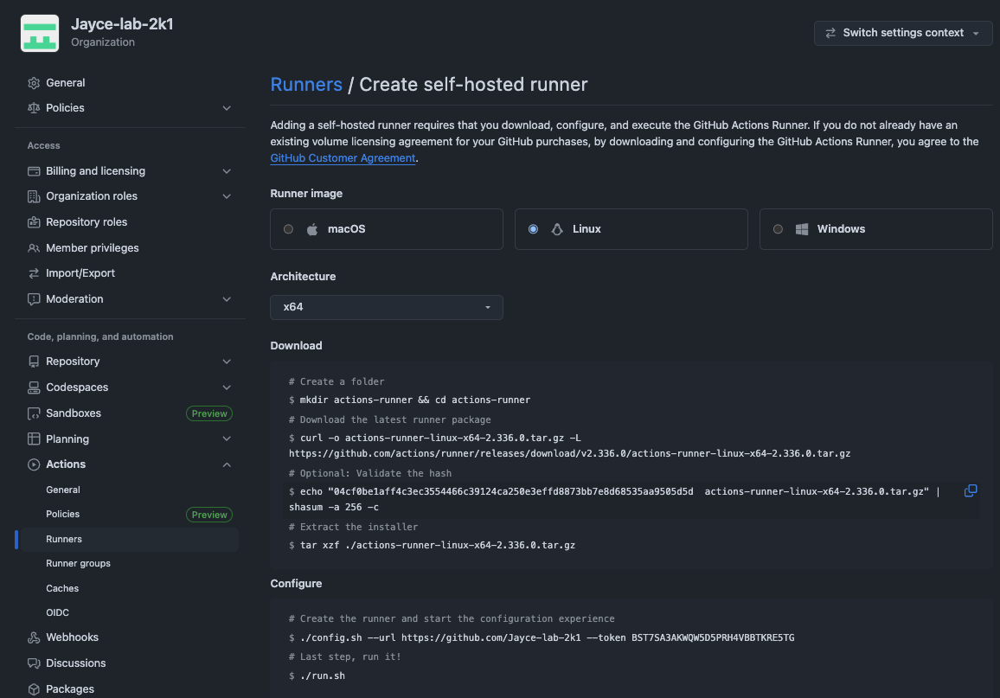

- Setup Github action agent in EC2 instance. Follow command and instructions in the Github action agent page.
```text
Runner group: dev-easyshop
Runner name: dev-easyshop
Runner labels: default [Enter]
Work folder: default [Enter]
```

- Don't run `./run.sh`, because runner agent will die when the session ends. Instead, install it as a service so it stays up. 
```bash
sudo ./svc.sh install
sudo ./svc.sh start
sudo ./svc.sh status
```
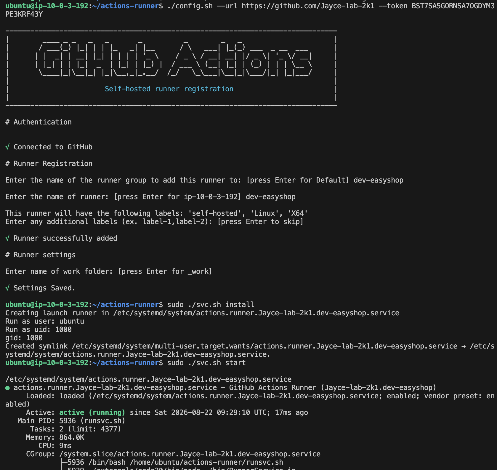
Verify the agent is running in terminal and Github console.
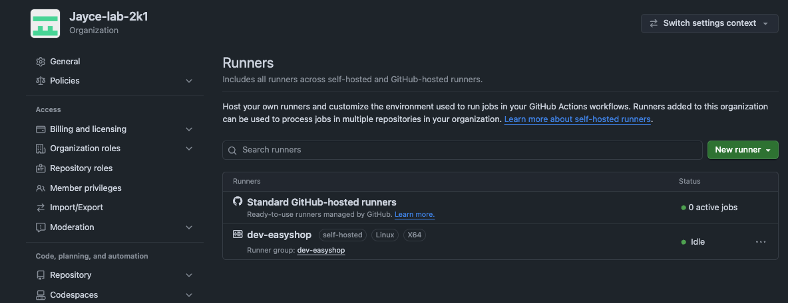

- Create environment **dev** for each service repository. From there create environment variables for each service repository.
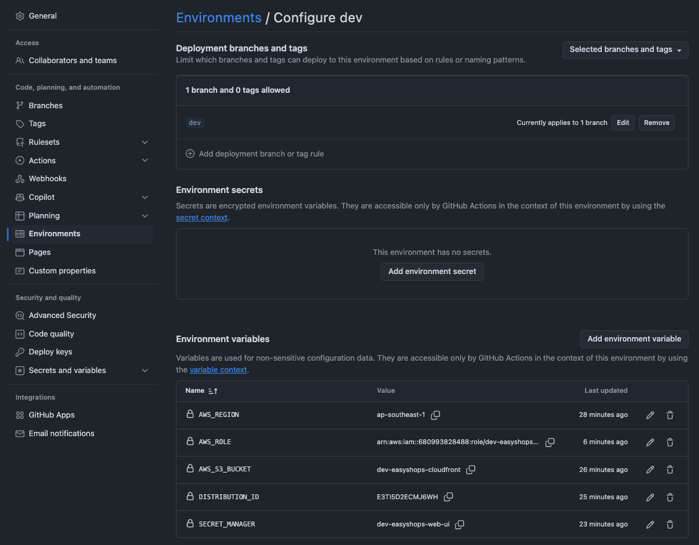
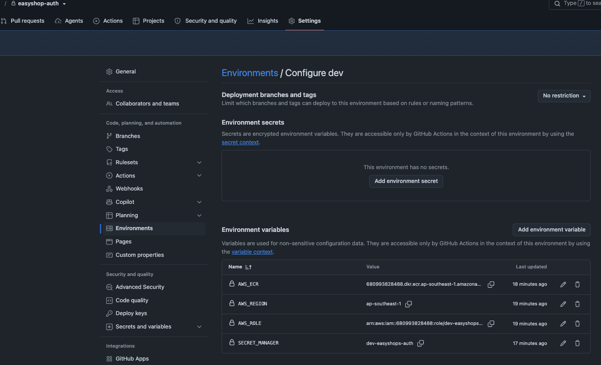

Set these on the **`dev` environment** in each GitHub repo (`Settings → Environments → dev`):

| Variable | Services used | Description |
| -------- | ---------------------- | ----------- |
| `AWS_REGION` | Services, Infra | AWS region for the project. |
| `AWS_ROLE` | Services, Infra | IAM role the runner assumes for deploy (`dev-easyshops-github-ci-provider`). |
| `SECRET_MANAGER` | Services | Secrets Manager secret name used to build `.env` at deploy. App keys live here, same as each service **`.env.example`**. |
| `AWS_S3_BUCKET` | Web-ui | CloudFront origin S3 bucket name. |
| `DISTRIBUTION_ID` | Web-ui | CloudFront distribution ID for cache invalidation. |
| `AWS_ECR` | Auth, Product, Cart | ECR repository URL. |

* Push the changes to the repository to trigger the CI/CD pipeline. Result:
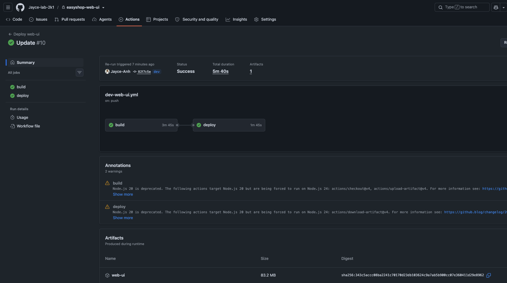 
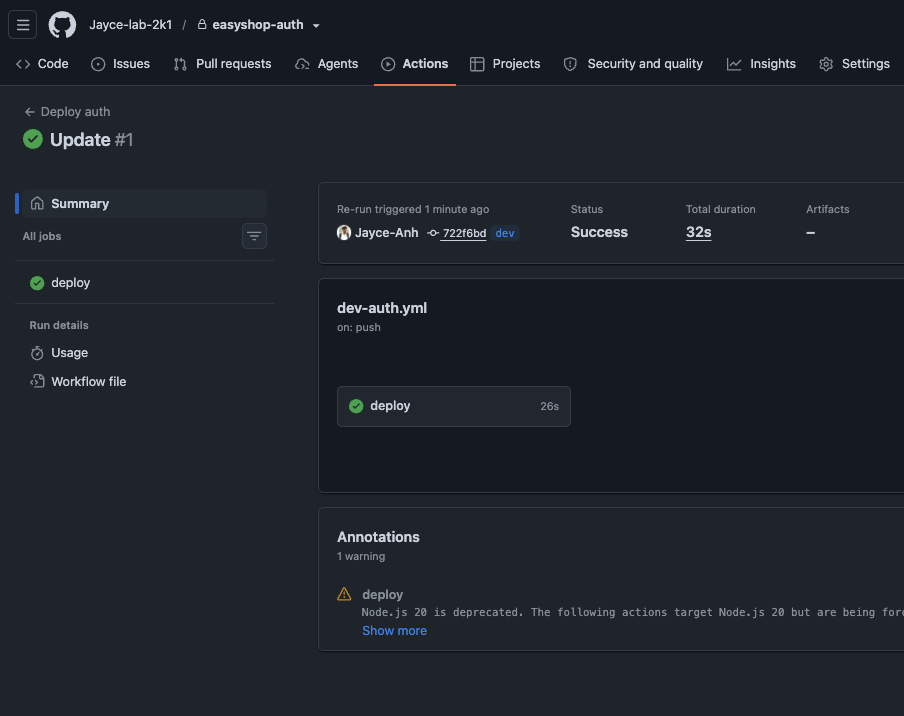
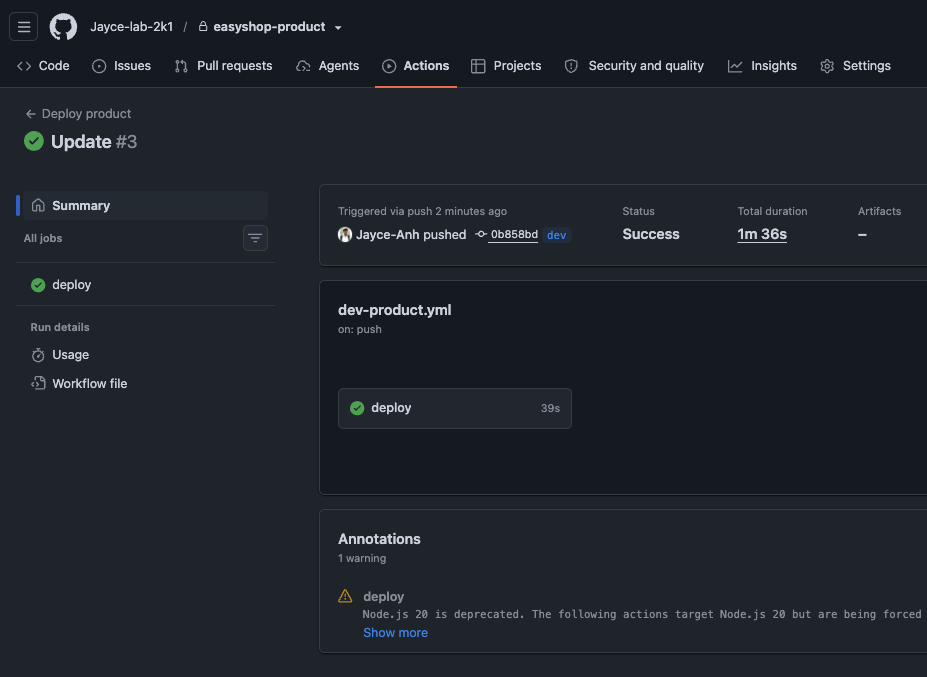
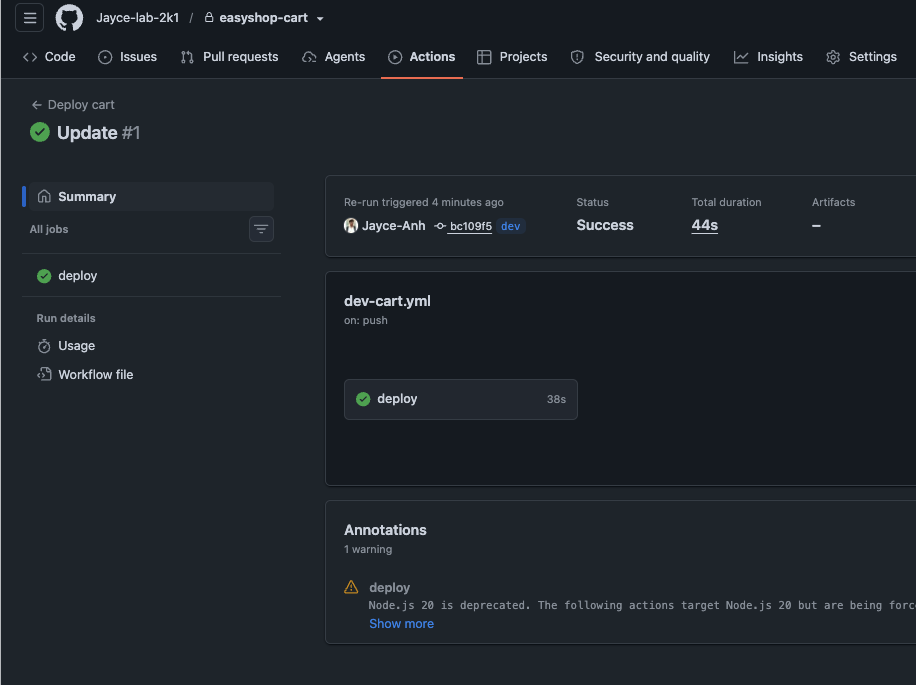
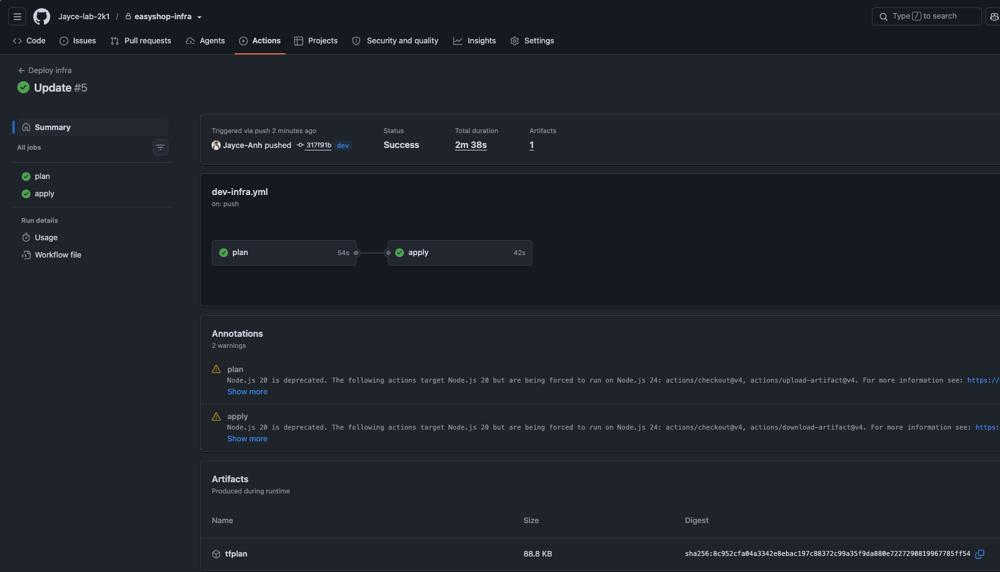

### 9. Verify application development environment

- Open the development storefront on browser: `https://dev-easyshops.jayce-lab.works`

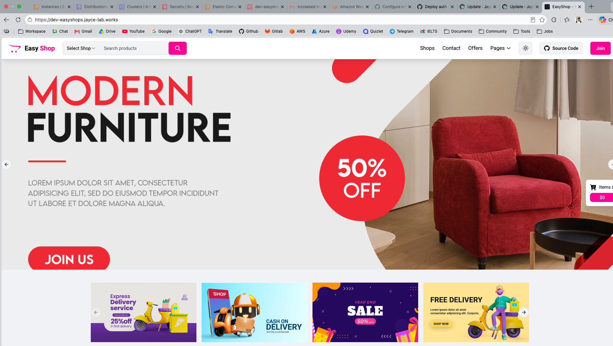


## V. Deploy Infrastructure — Production

### 1. Deploy the rest of the services

- Hosted Zone are already created in development environment.
- Deploy the remaining modules from `easyshop-infra/main.tf`

```bash
cd easyshop-infra
git switch main
terraform apply
```

| Service | Component | Description |
| ------- | --------- | ----------- |
| Hosted Zone | Route53 public hosted zone | Shared zone for `jayce-lab.works` (created in section IV) |
| VPC | VPC, subnets, IGW, NAT Gateway, route tables | Creates the network in `ap-southeast-1` with 2 AZs (`1b`, `1c`), 2 public and 2 private subnets, Internet Gateway, and NAT Gateway |
| KMS | Customer managed key (CMK) | Encrypts ECR, DocumentDB, ElastiCache, Secrets Manager, and EBS |
| ECR | Private repositories | Image registries for `auth`, `product`, and `cart` (keep last 3 images) |
| Bastion / app EC2 | EC2 Spot (`t3.small`) | Used as the **dev** all-in-one host; also a jump host for private prod resources; EventBridge Scheduler starts at 09:00 and stops at 18:00 SGT |
| ALB | External Application Load Balancer | HTTPS load balancer with IP target groups for auth (4000), product (5000), and cart (6000) |
| CloudFront | CloudFront + S3 origin | Hosts web-ui on S3; alias `easyshops.jayce-lab.works`; routes `/api/*` to ALB |
| DocumentDB | DocDB 5.0 (`db.t3.medium`, port 27017) | MongoDB-compatible cluster in private subnets; EventBridge Scheduler starts at 09:00 and stops at 18:00 SGT |
| Secrets Manager | App secrets | Stores DocumentDB and Valkey connection values for auth, product, cart, and web-ui |
| Valkey | ElastiCache Valkey 7.2 (`cache.t3.micro`, 2 nodes, port 6379) | In-memory cache for product and cart; automatic failover |
| ECS | Fargate cluster | `auth`, `product`, and `cart` in private subnets (256 CPU / 512 MB, desired 1); Container Insights on |
| CI/CD | CodePipeline + CodeBuild | One pipeline per repo (`web-ui`, `auth`, `product`, `cart`); GitHub source via CodeStar Connections |

### 2. Update application secrets

- Go to AWS Secret Manager console, verify the secret is created by Terraform.
- It should already contain DocumentDB and Valkey connection values for auth, product, cart, and web-ui.

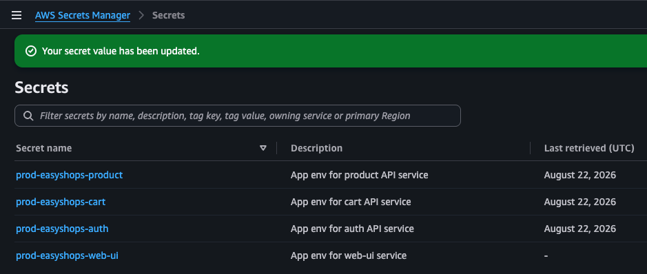
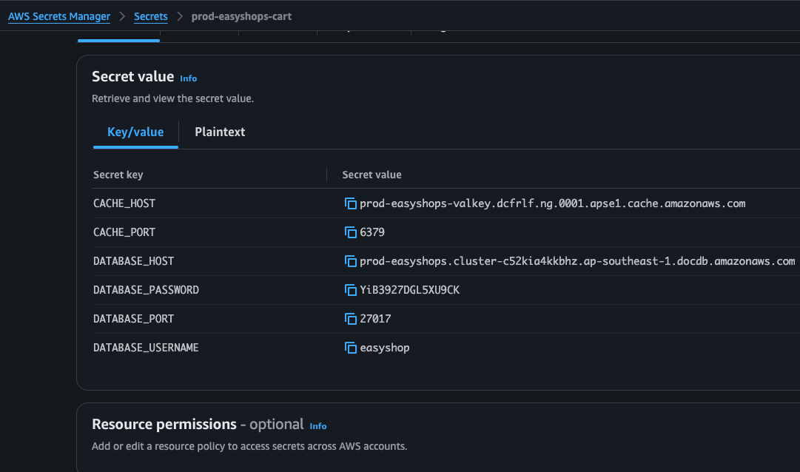

- Add the remaining secrets values in `env.example` file in each auth, product, cart, and web-ui service folder. 
- The envs must be in plain text format for Docker Compose to read.
  - Option 1: You can use python3 to convert the secret values from json format to plain text format in cicd pipeline file `modules/cicd/pipeline/prod-easyshop-backend.yml`.
```bash
aws secretsmanager get-secret-value --secret-id ${SECRET_MANAGER} --region ${REGION} --query SecretString --output text | jq -r 'to_entries[] | "\(.key)=\(.value)"' > .env
```
- Option 2: Edit convert all secrets values to plain text format manually in AWS console. 
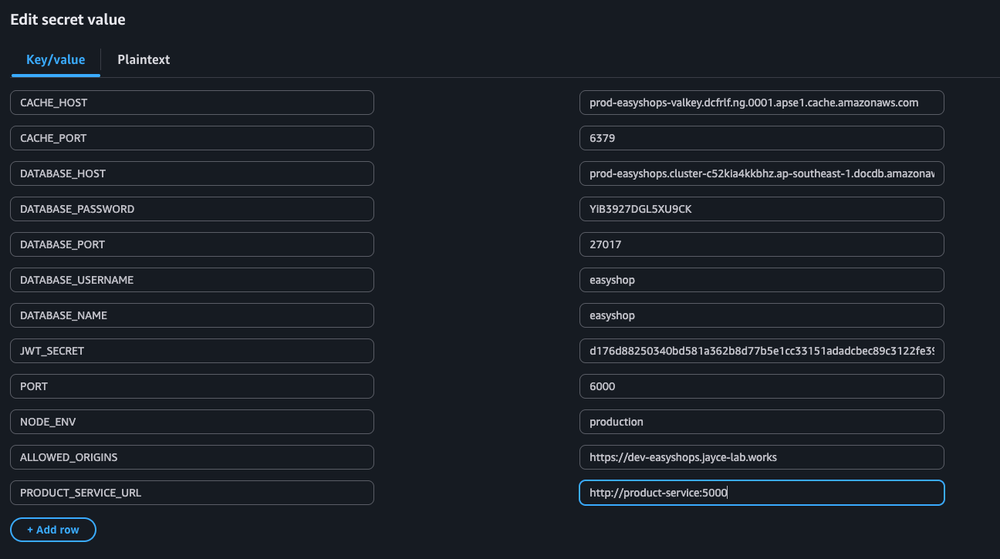

### 3. Setup CI/CD for production
- Go to AWS Console → CodePipeline → Developer Tools → Settings → Connections. Find prod-easyshops-github → click it → Update pending connection button.
- AWS opens a popup that redirects to GitHub automatically. Click "Install a new app" button (next to the search box).
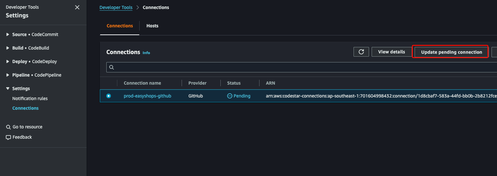
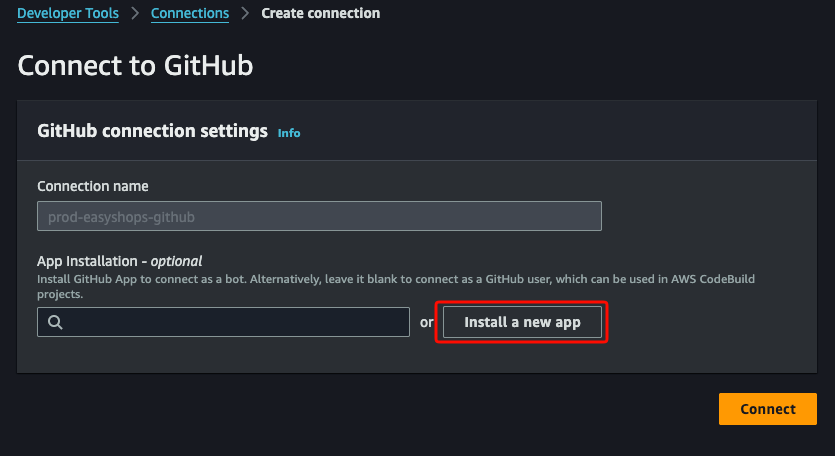

- On that GitHub page, at the top there's an account switcher — pick Jayce-lab-2k1 organization (not your personal account).
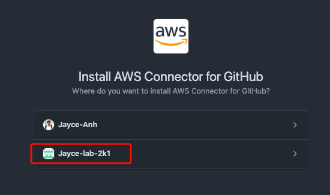

- Choose "Only select repositories" → select the easyshop-* repos → click Install & Authorize.
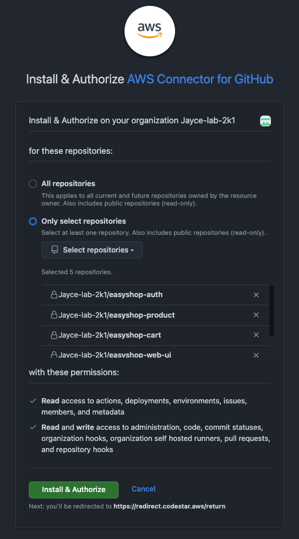

- It redirects back to AWS -> Click "Connect" button. Connection status should become Available.
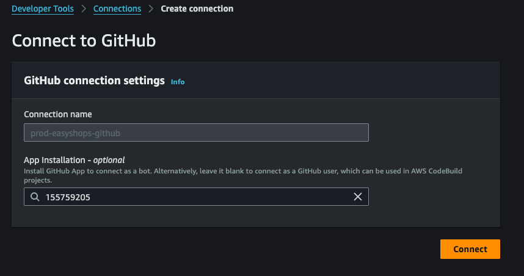
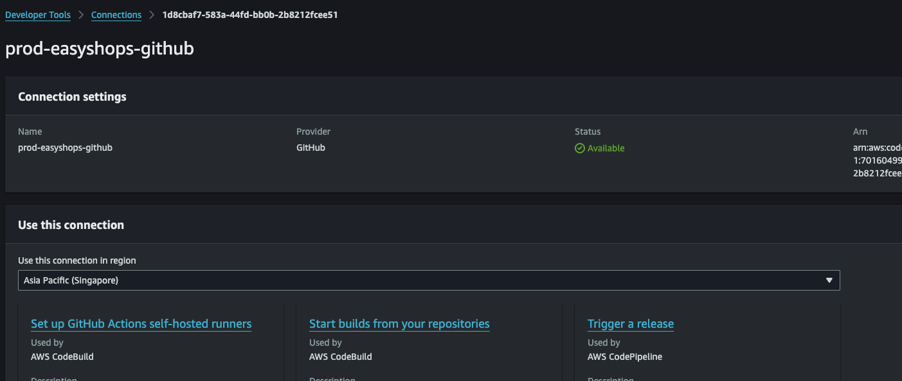

- Run and verify pipelines in AWS Console.
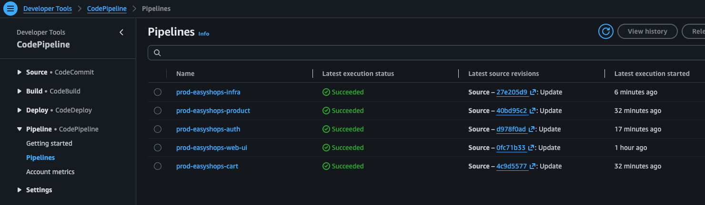
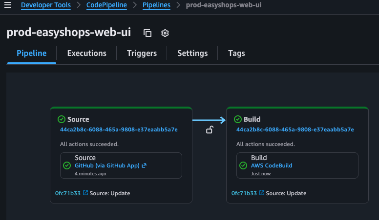
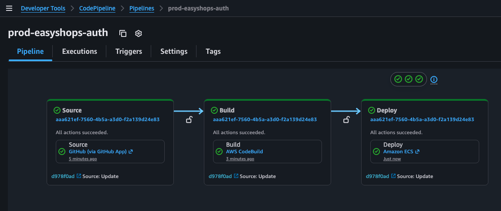
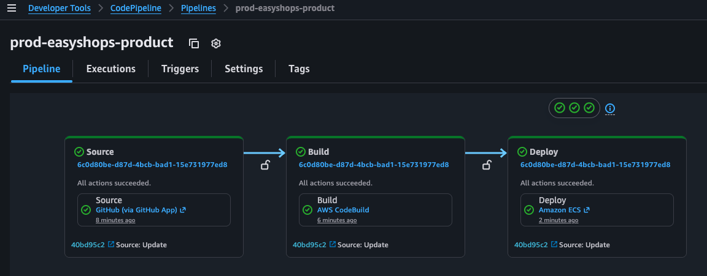
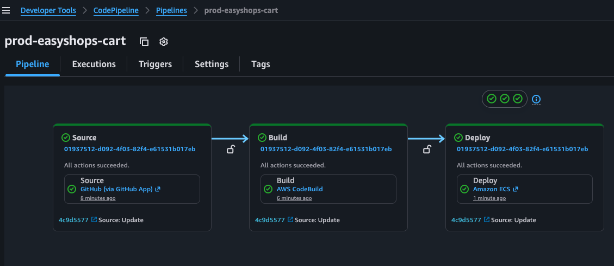

- In Infrastructure pipeline, on Approval stage, click "Submit" button to continue to Apply stage.
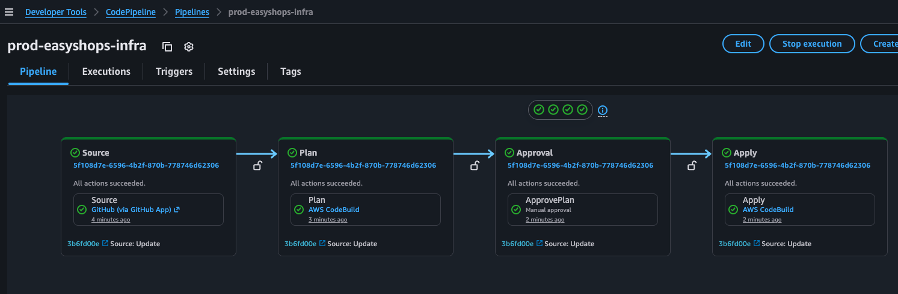

- Verify application storefront in browser: `https://easyshops.jayce-lab.works`

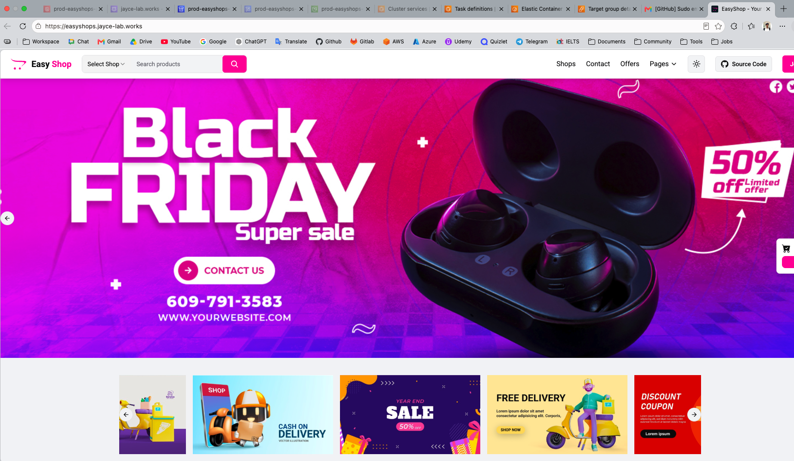

### 4. Setup logging and monitoring (CloudWatch)

Prod API logs go to CloudWatch (7-day retention):

| Service | Log group |
| ------- | --------- |
| Auth | `/ecs/prod-easyshops-auth` |
| Product | `/ecs/prod-easyshops-product` |
| Cart | `/ecs/prod-easyshops-cart` |

- Open **CloudWatch → Log groups** and filter by `/ecs/prod-easyshops`.
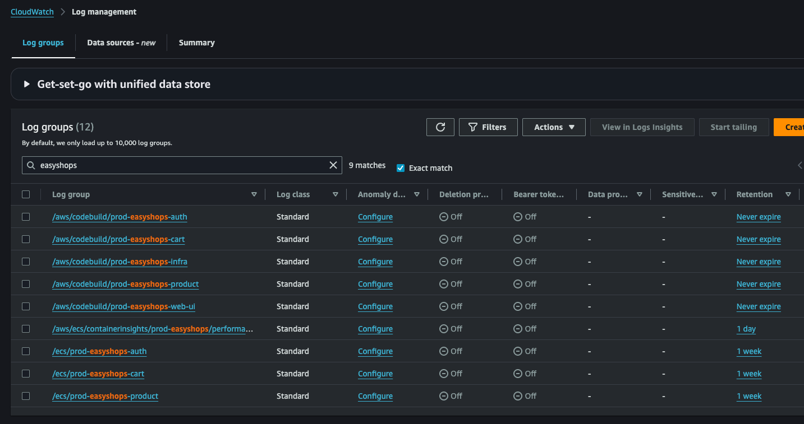
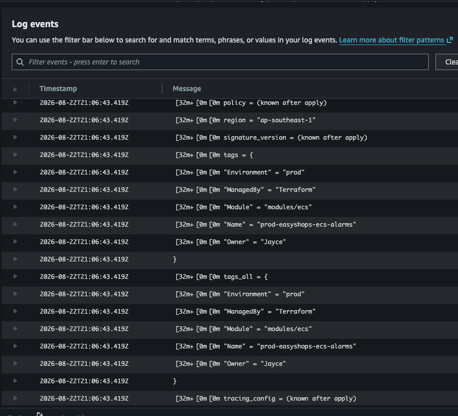

- ECS Container Insights is enabled on cluster `prod-easyshops` for CPU, memory, and task metrics.
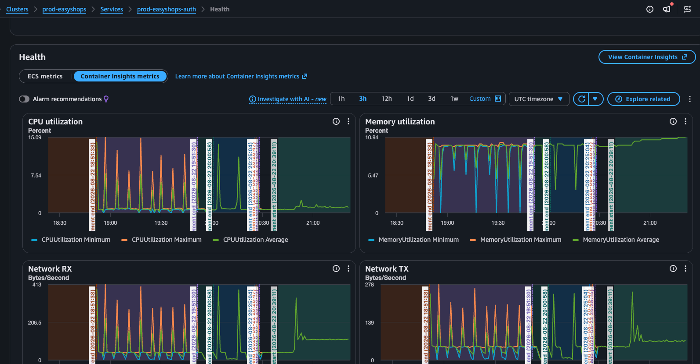

- Each resource module ships its own `cloudwatch.tf` and dashboard:

| Module | Dashboard | Widgets |
| ------ | --------- | ------- |
| `modules/ecs` | `prod-easyshops-ecs-observability` | ECS CPU % and Memory % per service (auth, product, cart), recent log tail |
| `modules/database/docdb` | `prod-easyshops-docdb-observability` | DocDB CPU, Read/Write IOPS, Read/Write Latency, Connections, Volume Bytes Used |
| `modules/alb` | `prod-easyshops-alb-observability` | ALB Target 4XX/5XX error counts per service (error rate), total request count |

- Open **CloudWatch → Dashboards** and verify the three dashboards above are created.
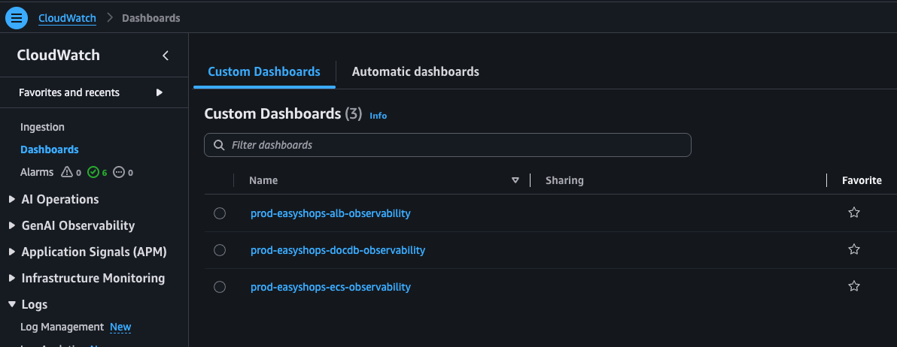
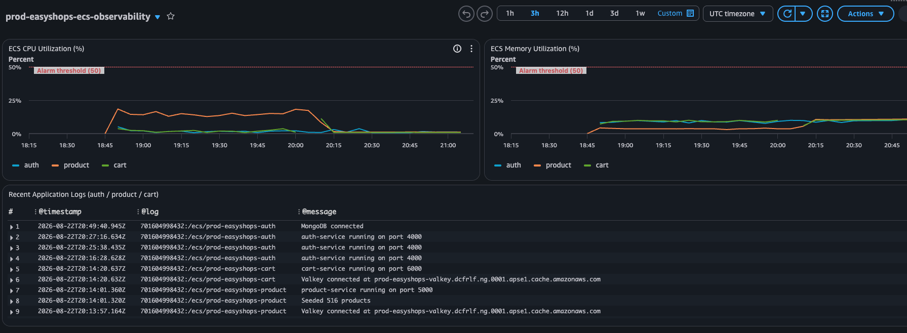
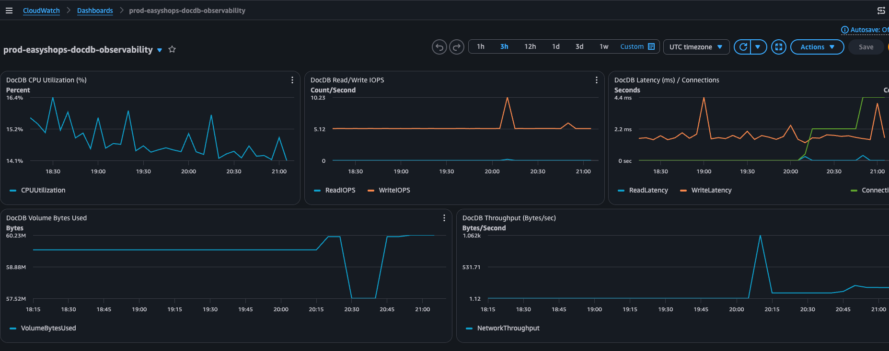

- `modules/ecs/cloudwatch.tf` also creates a CPU-high and Memory-high alarm per service (auth, product, cart), firing when utilization is above 50% for 2 consecutive periods. Alarms notify an SNS topic (`prod-easyshops-ecs-alarms`); set `alarm_email` in `terraform.tfvars` to get email notifications.
- Open **CloudWatch → Alarms** and verify the 6 ECS alarms are created.
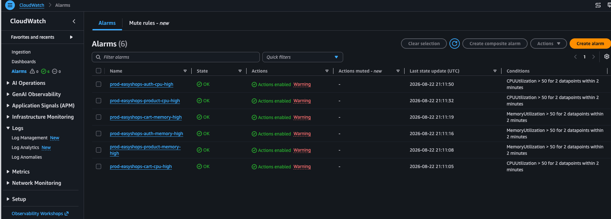
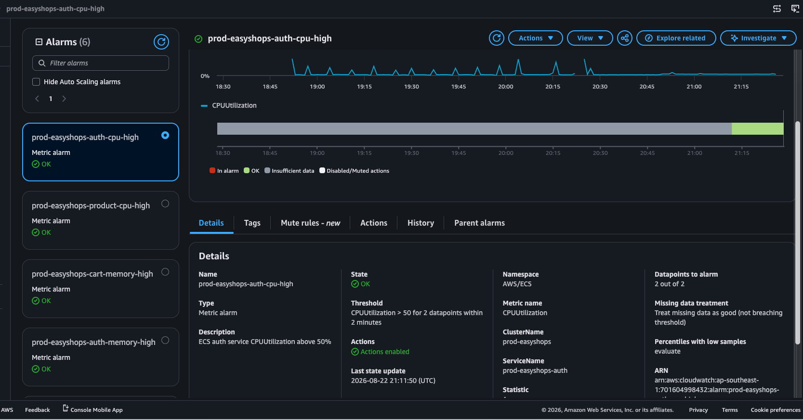

## VI. Clean up the lab

Destroy from `easyshop-infra` for each environment. Empty the CloudFront S3 bucket and ECR images if destroy is blocked by remaining objects.

### 1. Destroy the lab

```bash
cd easyshop-infra

git switch dev
terraform plan --destroy
terraform destroy

git switch main
terraform plan --destroy
terraform destroy
```

Review the plan. Type `yes` to confirm destroy the lab.

### 2. Destroy the S3 state bucket (optional)

The remote state bucket in `easyshop-infra/remote-tfstate` has `prevent_destroy`. Keep it unless you want to remove all Terraform state.

To delete it, set `prevent_destroy = false` in `modules/s3/remote-state.tf`, then:

```bash
cd easyshop-infra/remote-tfstate
terraform destroy
```

## Thanks for reading!
